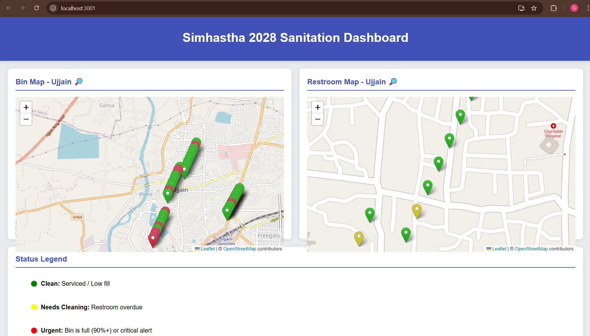
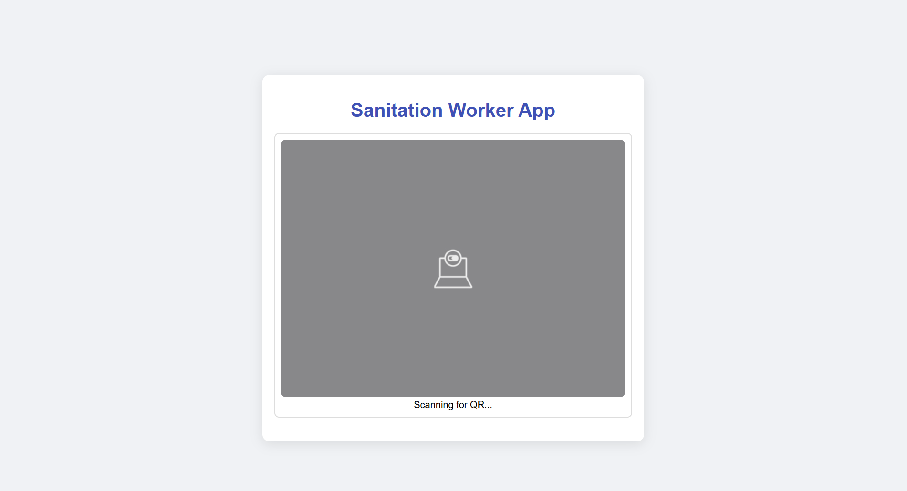
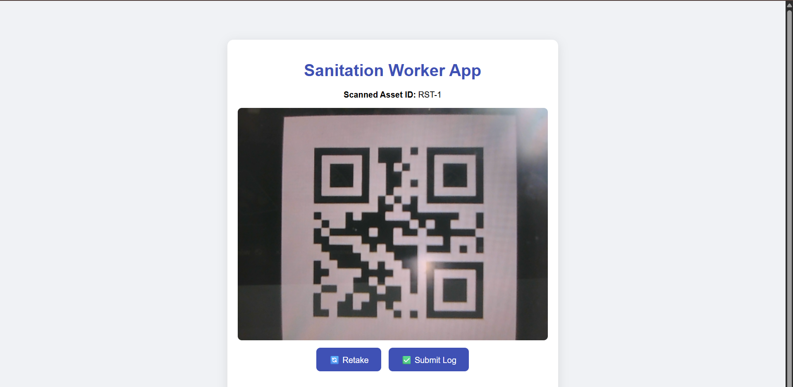
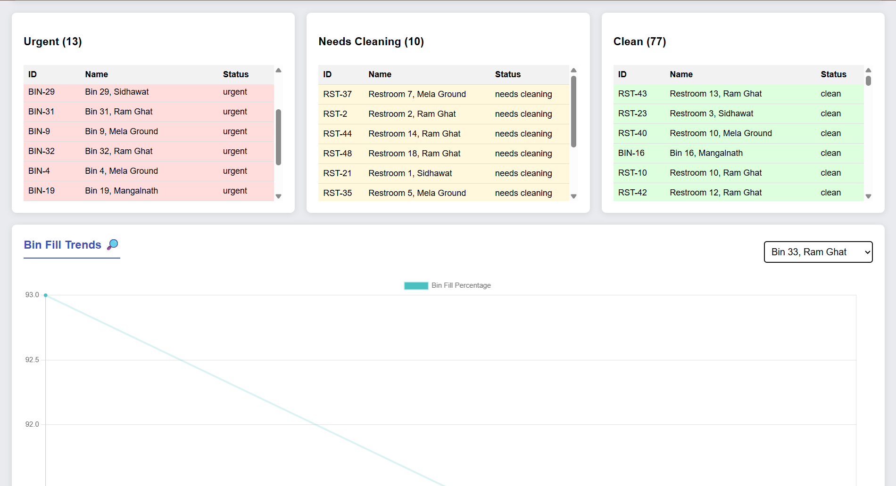

# 🚀 Smart Sanitation Monitoring System for Simhastha 2028 Hackathon

## 📌 Project Overview
The **Smart Sanitation Monitoring System** is a three-tier, end-to-end solution designed to address the massive sanitation challenges of the **Simhastha Kumbh Mela 2028 in Ujjain, India**.  

This project provides a **real-time, data-driven platform** for supervisors to manage a network of sanitation assets, ensuring **cleanliness, health, and pilgrim satisfaction**.  

✅ Replaces manual monitoring with automated logging  
✅ Provides **verifiable cleaning records** with QR codes + photos  
✅ Sends **real-time alerts** for urgent sanitation issues  
✅ Offers a **priority-based workflow** for cleaning crews  

---

## ✨ Key Features

- **🗺 Real-time Asset Monitoring**  
  Interactive map of Ujjain showing **50 bins** and **50 restrooms** with color-coded markers:  
  - 🟢 **Green** → Clean / Recently serviced  
  - 🟡 **Yellow** → Needs cleaning (restroom overdue by 90 mins)  
  - 🔴 **Red** → Urgent (bin fill level ≥ 90%)  

- **📱 Worker Verification App**  
  Mobile-friendly web app (`index.html`) where workers can:  
  - Scan unique **QR codes** for each asset  
  - Upload a **photo as proof of cleaning**  

- **📊 Predictive Operations**  
  - Historical usage data  
  - Real-time **Usage Trends chart**  
  - Helps supervisors allocate resources efficiently  

- **📋 Dynamic Priority List**  
  - Scrollable live table  
  - Ranks assets by urgency  
  - Guides cleaning crews for efficient workflow  

- **⚡ Scalable Architecture**  
  - Node.js backend  
  - PostgreSQL database  
  - Can scale from **100 assets → millions of users**  

---

## 🛠 Technical Stack

- **Frontend:** React.js, `react-leaflet`, `react-chartjs-2`, `jsQR`  
- **Backend:** Node.js, Express.js, PostgreSQL (`pg`), `mqtt.js`  
- **Database:** PostgreSQL (via Docker)  
- **Dev Tools:** Python for QR generation + mock activity scripts  

---

## ⚙️ Setup and Installation

### 📌 Prerequisites
- Node.js + npm  
- Docker (for PostgreSQL database)  
- Python 3 + pip  

---

### 1️⃣ Database Setup

```bash
docker run --name sanitation_db \
  -e POSTGRES_USER=admin \
  -e POSTGRES_PASSWORD=password \
  -e POSTGRES_DB=sanitation_db \
  -p 5432:5432 -d postgres
```

Then connect to the DB and create tables using:
```
psql -U admin -d sanitation_db -h localhost -p 5432
```
Run SQL commands from ml-scripts/create_tables.sql.

### 2️⃣ QR Code Generation
```
cd ml-scripts
pip install qrcode Pillow
python generate_qrs.py
```

👉 Creates a qr-codes/ folder with QR images for 100 assets.

### 3️⃣ Run Backend & Mock Services

Use **three separate terminals:**

**Terminal 1 – Backend Server:**
```
cd backend
npm install
node server.js
```

**Terminal 2 – Mock Bin Sensor:**
```
cd ml-scripts
python mock_bin_activity.py
```

**Terminal 3 – Mock Restroom Sensor:**
```
cd ml-scripts
python mock_restroom_activity.py
```

### 4️⃣ Run the Dashboard
```
cd dashboard
npm install
npm start
```

👉 Opens at http://localhost:3000

## 🚀 Usage

**Supervisor:**

Access dashboard → Monitor live map, usage trends, and priority list.

**Worker:**

Open web-app/index.html (via live-server at http://localhost:8080
) →
Scan QR → Take photo → Submit cleaning log.

## 📸 Screenshots & Demo
🔹 Live Dashboard


🔹 QR Code Scan Flow





🔹 Priority List & Alerts



## 🔮 Future Enhancements

- 📲 Mobile app for supervisors (task assignment)

- 🔔 Real-time notifications (SMS, push alerts)

- 🤖 ML-powered predictive cleaning routes

- 🔑 User authentication & role-based access control

- 🏆 Hackathon Info


**Built for Simhastha 2028 Hackathon – Ujjain, India**      
**Aiming to redefine sanitation monitoring for millions of pilgrims.**